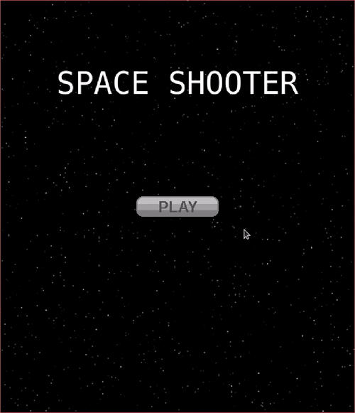
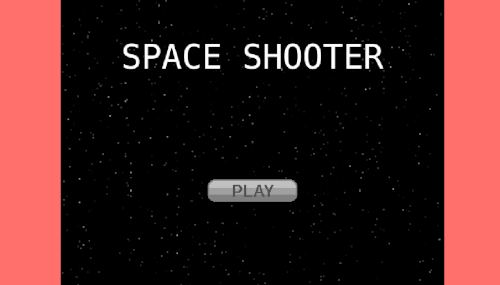
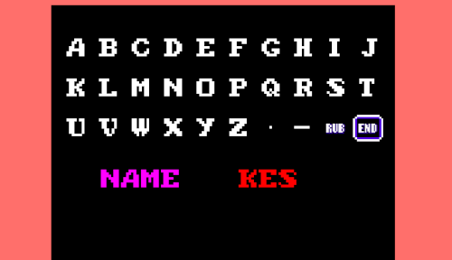
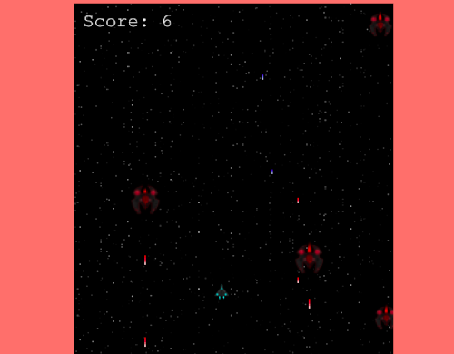
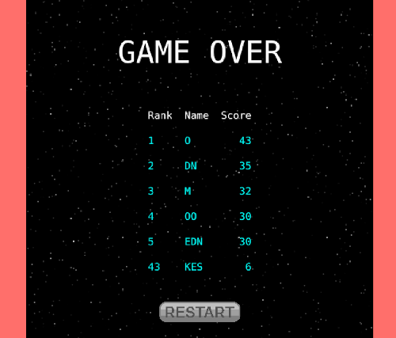
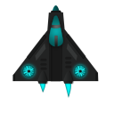
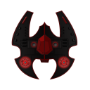
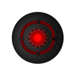

# Shooter Game (JavaScript Capstone Project)



> A shmup game coded in JavaScript using Phaser 3. 


<p>
  
</p>
<p>
  
</p>
<p>
  
</p>
<p>
  
</p>

## About the Project

The main objective of this project is to build a shooter game. The instructions to code this game can be found in this [tutorial](https://learn.yorkcs.com/category/tutorials/gamedev/phaser-3/build-a-space-shooter-with-phaser-3/). I ported the code to ES6, made changes in gameplay, created new assets and hooked it up to an external scoring API using promises and async functions.

## Game Intro

You are a rookie fighter pilot fighting for your company - _Kill'emAll Inc._ - in the 37th Global Corporate war. Frustrated with the company bureaucracy's indecisive leadership in the war, you decide to take matters into your own hands and sneak out with your favorite plane from the corporation's hangar. 

What luck! You found a huge bunch of the enemy aircraft flying to the nearby Atlantis continent. They are on their way to deliver humanitarian aid, to the survivors of a recent, stray chemical attack.

You steel yourself and resolve to kill as many of the evil enemy forces, before they take you down. Attack!!

(Have Fun)

### Instructions

- Move using `WSAD`.
- `Spacebar` to shoot.
- Kill as many as you can.
- Don't die.

### Dramatis Personae

Throughout the game, you'll be controlling your trusty space fighter ship, the _Kill'em Fighter M1_. This state-of-the-art aircraft can fire charged particles of _chi_ energy, at a fast rate. The _chi_ energy power plant on board the fighter can regenerate these particles indefinitely, so you never run out.  

<p align="center">
  
</p>

You are facing down an infinite horde of goody two shoes, resolved to help the suffering denizens of the Atlantis continent. How dare they look down on you! The most common type of enemy aircraft is the _AxeOne Cutter_. Though this looks like an evil, red, hellship, it has the same capabilities as your own craft.

<p align="center">
  
</p>

A less common enemy variety is the _Crimson Kamekaze_. These wont fire any projectiles at you. But the moment they detect you, they will chase you endlessly until they manage to crash into you. It would be tricky to get rid of this enemy as the _AxeOne Cutters_ try to overwhelm you with their missile barrage.

<p align="center">
  
</p>

And finally, there are the _Relief Ships_. These are the worst. They don't even fire at you. Probably because they don't respect you as a worthy enemy. Supposedly they are carrying relief materials for the starving refugees in the Atlantis continent. The enemy's true intentions are as inscrutable as the enemy himself. Don't let any of them survive.

<p align="center">
  
</p>

## Built With

- HTML, CSS and JavaScript
- [NodeJS](https://nodejs.org) is required to install dependencies and run scripts via `npm`
- ES6 support via [Babel 7](https://babeljs.io/)
- [Webpack 4](https://webpack.js.org/) for hot-reloading for development and production-ready builds.
- Phaser 3 (A JavaScript Game Development Framework)

## Design

All of the sprites, backgrounds, buttons and the sounds can be found on [OpenGameArt](https://opengameart.org/).

## Live Demo

[Live Demo Link](demo link)

## Code Review

- Clone this repository. 
- Switch to the `game` branch. 

## Development Instructions

### Available Commands

| Command | Description |
|---------|-------------|
| `npm install` | Install project dependencies |
| `npm start` | Build project and open web server running project |
| `npm run build` | Builds code bundle with production settings (minification, uglification, etc..) |
| `npm run test` | Runs the test suites | 

### Writing Code

After cloning the repo, run `npm install` from your project directory. Then, you can start the local development server by running `npm start`.

### Integration with the Leaderboard API service (by Microverse)

I obtained a unique ID for my game by querying the leaderboard API provided by Microverse, using `curl`

```
curl --header "Content-Type: application/json" --request POST --data '{"name": "Shooter Game by Keshav"}' https://us-central1-js-capstone-backend.cloudfunctions.net/api/games/
```

Example result
```

{"result":"Game with ID: Qa2XUOTtOtFp4SJONyU5 added."}
```

After starting the development server with `npm start`, you can edit any files in the `src` folder
and webpack will automatically recompile and reload your server (available at `http://localhost:8080`
by default).

## Customizing Template

### Babel
You can write modern ES6+ JavaScript and Babel will transpile it to a version of JavaScript that you want your project to support. The targeted browsers are set in the `.babelrc` file and the default currently targets all browsers with total usage over "0.25%" but excludes IE11 and Opera Mini.

  ```
  "browsers": [
    ">0.25%",
    "not ie 11",
    "not op_mini all"
  ]
  ```

### Webpack
If you want to customize your build, such as adding a new webpack loader or plugin (i.e. for loading CSS or fonts), you can modify the `webpack/base.js` file for cross-project changes, or you can modify and/or create new configuration files and target them in specific npm tasks inside of `package.json'.

## Deploying Code
After you run the `npm run build` command, your code will be built into a single bundle located at `dist/bundle.min.js` along with any other assets you project depended. 

If you put the contents of the `dist` folder in a publicly-accessible location (say something like `http://mycoolserver.com`), you should be able to open `http://mycoolserver.com/index.html` and play your game.

## Author

👤 **Keshav Chakravarthy**

- Github: [@keshav-c](https://github.com/keshav-c)
- Linkedin: [k3shavchakravarthy](https://www.linkedin.com/in/k3shavchakravarthy/)

## 🤝 Contributing

Contributions, issues and feature requests are welcome!

Feel free to check the [issues page](issues link).

## Show your support

Give a ⭐️ if you like this project!

## Acknowledgments

- This projects uses the template for Webpack based projects given [here](https://github.com/photonstorm/phaser3-project-template)
- Microverse for reviewing the code
- Opengameart for open source assets
- Jared from York Computer Solutions LLC for the Phaser tutorial

## 📝 License

This project is [MIT](https://opensource.org/licenses/MIT) licensed.
